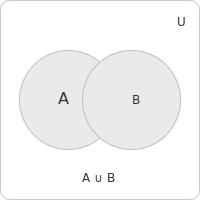
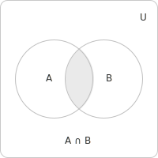
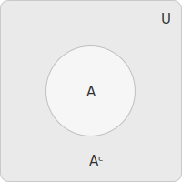
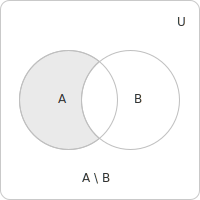
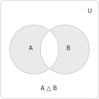
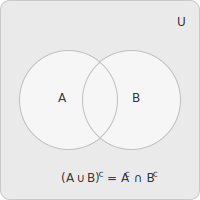

:title: Sets
:source: https://algebrica.org/sets/
:license: CC BY-NC 4.0
:tags: cardinality, cartesian-product, de-morgan-laws, inclusion-exclusion, ordered-pair, partition, power-set, set, set-operations, subset, universal-set

Sets
====

Introduction
------------

A set is a collection of objects called elements that are considered as a whole. Sets are represented by uppercase letters :math:`A`, :math:`B`, :math:`C`, and their elements by lowercase letters. The notation :math:`x \in A` indicates that an object :math:`x` belongs to the set :math:`A`, while :math:`x \notin A` indicates that :math:`x` is not an element of :math:`A`. For any given object, it is always possible to determine unambiguously whether the object belongs to the collection or not.

A set can be described by enumeration or by set-builder notation. Enumeration consists in explicitly listing each element of the set, and is practical when the cardinality of the set is finite and small:

.. math::

   A = \{a_1, a_2, a_3, a_4\}

When the elements are numerous or infinite, set-builder notation becomes preferable. In this case the set is described by the property that each element must satisfy in order to belong to it:

.. math::

   A = \{ x \in \mathbb{Z} \mid x > 4, \ x \leq 8 \}

The previous notation defines :math:`A` as the set of all integers :math:`x` such that :math:`x > 4` and :math:`x \leq 8`, that is, the following set:

.. math::

   A = \{5, 6, 7, 8\}

The empty set contains no elements, is denoted by :math:`\emptyset` or :math:`\{\}`, and plays a role in set theory analogous to that of zero in arithmetic.

The universal set
-----------------

A main collection containing all objects under consideration is called the universal set and is written as :math:`U`. All sets in a given context are subsets of :math:`U`. The choice of :math:`U` depends on the situation. In elementary number theory one often works with :math:`U = \mathbb{Z}`, whereas in real analysis the usual choice is :math:`U = \mathbb{R}`.

.. admonition:: Note

   The universal set is the tool that makes the notion of set complement unambiguous, as discussed in the section on set operations.

Cardinality of finite sets
--------------------------

The cardinality of a set :math:`A`, denoted :math:`|A|`, is the number of elements the set contains. The cardinality can be measured in different situations, as follows.

The empty set has cardinality :math:`|\emptyset| = 0`. Two finite sets have the same cardinality if and only if they contain the same number of elements.

The cardinality of the power set of a finite set :math:`A` with :math:`n` elements is given by:

.. math::

   |\mathcal{P}(A)| = 2^n

The cardinality of the Cartesian product of two finite sets :math:`A` and :math:`B` is given by:

.. math::

   |A \times B| = |A| \cdot |B|

In this case each element of :math:`A` can be paired with every element of :math:`B`, producing :math:`|A| \cdot |B|` ordered pairs.

The cardinality of the union of two sets :math:`A` and :math:`B` is given by:

.. math::

   |A \cup B| = |A| + |B| - |A \cap B|

The previous expression is the inclusion-exclusion principle, which ensures that elements common to both sets are counted once. Every element of :math:`A \cup B` appears in the sum :math:`|A| + |B|`. Elements lying in :math:`A \cap B` are counted twice, so the term is subtracted to guarantee the correct count.

The principle extends to three sets, as expressed by:

.. math::

   |A \cup B \cup C| = |A| + |B| + |C| - |A \cap B| - |A \cap C| - |B \cap C| + |A \cap B \cap C|

The structure of the formula can be read as follows:

* Elements belonging to one set are counted only once.
* Elements shared by two sets are counted twice and subtracted once, yielding a net contribution of :math:`1`.
* Elements lying in all three sets are added three times, subtracted three times, and added back once through the triple intersection, again producing a net contribution of one.

Subsets and power sets
----------------------

The notions of subset and power set are introduced together. Subsets are sets whose elements all belong to another set, while power sets are sets whose elements are themselves subsets of a given set. A set :math:`A` is a subset of :math:`B` if every element of :math:`A` is also an element of :math:`B`:

.. math::

   A \subseteq B \iff \forall \ x, \ x \in A \rightarrow x \in B

Two sets are equal if and only if each is contained in the other, which is the standard way to establish set equality in mathematics:

.. math::

   A = B \iff A \subseteq B \text{ and } B \subseteq A

If :math:`A \subseteq B` and :math:`A \neq B`, then :math:`A` is a proper subset of :math:`B`, denoted :math:`A \subsetneq B`, and in this case there exists at least one element in :math:`B` that does not belong to :math:`A`. The empty set is a subset of every set. The inclusion :math:`\emptyset \subseteq A` holds for any set :math:`A`, because the implication :math:`x \in \emptyset \Rightarrow x \in A` is vacuously true.

The power set of a set :math:`A` is the set of all subsets of :math:`A`, denoted :math:`\mathcal{P}(A)`. It includes the empty set :math:`\emptyset` and the set :math:`A` itself. If :math:`A` has :math:`n` elements, then :math:`\mathcal{P}(A)` has :math:`2^n` elements. For example, if :math:`A = \{a, b, c\}`, then the power set contains :math:`2^3 = 8` elements:

.. math::

   \mathcal{P}(A) = \{\emptyset, \ \{a\}, \ \{b\}, \ \{c\}, \ \{a,b\}, \ \{a,c\}, \ \{b,c\}, \ \{a,b,c\}\}

Partitions
----------

A partition of a set :math:`A` is a family of non-empty subsets :math:`\{A_i\}_{i \in I}` that do not overlap and cover the whole of :math:`A`. The following conditions must hold:

.. math::

   A_i \neq \emptyset \quad \forall \ i \in I \\[10pt]
   A_i \cap A_j = \emptyset \quad \forall \ i \neq j \\[8pt]
   \bigcup_{i \in I} A_i = A

The subsets :math:`A_i` are called the blocks of the partition, and each element of :math:`A` belongs to exactly one of them. A simple example is the set of integers :math:`\mathbb{Z}`, which can be partitioned into the set of even integers and the set of odd integers, since these two blocks are non-empty, disjoint, and together cover the whole of :math:`\mathbb{Z}`.

Partitions are related to equivalence relations. Given an equivalence relation on :math:`A`:

* The equivalence classes it induces form a partition of :math:`A`.
* Any partition of :math:`A` defines an equivalence relation by declaring two elements equivalent whenever they belong to the same block.

Set operations
--------------

Set operations generate new sets by combining the elements of different sets. The main operations are union, intersection, complement, and difference.

The union of :math:`A` and :math:`B` is the set of all elements that belong to at least one of the two sets. Elements common to :math:`A` and :math:`B` are listed only once, since sets do not allow repetitions.

.. math::

   A \cup B = \{x \mid x \in A \text{ or } x \in B\}

----

The intersection of :math:`A` and :math:`B` is the set of elements that belong to both sets:

.. math::

   A \cap B = \{x \mid x \in A \text{ and } x \in B\}

If :math:`A \cap B = \emptyset`, the two sets are disjoint and share no elements.

----

The complement of :math:`A` with respect to a universal set :math:`U` is the set of all elements in :math:`U` that do not belong to :math:`A`. It is written as:

.. math::

   A^c = \{x \in U \mid x \notin A\}

Another way to represent the complement of :math:`A` is :math:`\overline{A}` or :math:`U \setminus A`. A single set may yield different complements when :math:`U` changes, since the elements of the complement vary with the universal set we pick.

----

The difference of :math:`A` and :math:`B`, written :math:`A \setminus B`, is the set of elements that belong to :math:`A` but not to :math:`B`:

.. math::

   A \setminus B = \{x \mid x \in A \text{ and } x \notin B\}

The relation :math:`A \setminus B \neq B \setminus A` holds in general, since the difference of two sets is not a commutative operation. For any universal set that contains both :math:`A` and :math:`B` the identity :math:`A \setminus B = A \cap B^c` holds, linking the difference to the complement.

The symmetric difference of :math:`A` and :math:`B`, written :math:`A \triangle B`, is the set of elements that belong to one of the two sets but not to both:

.. math::

   A \triangle B = (A \setminus B) \cup (B \setminus A)

An equivalent representation is given by the following expression:

.. math::

   A \triangle B = (A \cup B) \setminus (A \cap B)

The symmetric difference is commutative and associative, and satisfies :math:`A \triangle A = \emptyset` and :math:`A \triangle \emptyset = A`. Together with intersection, it gives the collection of all subsets of a given set the structure of a Boolean ring.

Properties of set operations
----------------------------

The set operations satisfy a series of identities that form the foundation of Boolean algebra and hold for any sets :math:`A`, :math:`B`, and :math:`C` within a universal set :math:`U`. Union and intersection are commutative operations. The order in which two sets are combined does not affect the result.

.. math::

   A \cup B = B \cup A \\[6pt]
   A \cap B = B \cap A

Both operations are also associative, meaning that when three sets are combined, the grouping of the operands is irrelevant.

.. math::

   (A \cup B) \cup C = A \cup (B \cup C) \\[6pt]
   (A \cap B) \cap C = A \cap (B \cap C)

Union and intersection distribute over each other, in a manner analogous to the distributive law of arithmetic.

.. math::

   A \cap (B \cup C) = (A \cap B) \cup (A \cap C) \\[6pt]
   A \cup (B \cap C) = (A \cup B) \cap (A \cup C)

The empty set and the universal set act as the identity element for union and intersection respectively. Combining any set with either of them returns the original set.

.. math::

   A \cup \emptyset = A \\[6pt]
   A \cap U = A

The empty set annihilates intersection and the universal set annihilates union. Combining any set with these elements returns the absorbing element rather than the original set:

.. math::

   A \cap \emptyset = \emptyset \\[6pt]
   A \cup U = U

Each element of :math:`U` lies either in :math:`A` or in its complement, never in both. Applying the complement operation a second time in succession returns the original set:

.. math::

   A \cup A^c = U \\[6pt]
   A \cap A^c = \emptyset \\[6pt]
   (A^c)^c = A

De Morgan's laws
----------------

De Morgan's laws are algebraic identities that describe how union and intersection behave under the complement operation. These identities allow set expressions to be rewritten in equivalent forms and help to simplify the operations.

.. math::

   (A \cup B)^c = A^c \cap B^c \\[6pt]
   (A \cap B)^c = A^c \cup B^c

The first law states that the complement of a union equals the intersection of the complements. An element is missing from :math:`A \cup B` only when it is missing from both :math:`A` and :math:`B`, which is the same as belonging to both :math:`A^c` and :math:`B^c`.

The second law states that an element is not in the intersection :math:`A \cap B` when it is missing from at least one of the two sets, and this places it in :math:`A^c \cup B^c`.

These laws extend to arbitrary finite collections of sets. For the sets :math:`A_1, A_2, \ldots, A_n` the following relations hold:

.. math::

   \left(\bigcup_{i=1}^{n} A_i\right)^c = \bigcap_{i=1}^{n} A_i^c \\[6pt]
   \left(\bigcap_{i=1}^{n} A_i\right)^c = \bigcup_{i=1}^{n} A_i^c

A correspondence exists between the algebraic structure of sets and that of the logical connectives. De Morgan's laws translate into the following equivalences for the connectives :math:`\land` and :math:`\lor`:

.. math::

   \neg(P \lor Q) \equiv \neg P \land \neg Q

.. math::

   \neg(P \land Q) \equiv \neg P \lor \neg Q

Example
-------

Let :math:`U = \{1, 2, 3, 4, 5, 6, 7, 8, 9, 10\}` be the universal set, and define the following two subsets:

.. math::

   A = \{1, 2, 3, 4, 6\} \\[6pt]
   B = \{2, 4, 6, 8, 10\}

The union and intersection of the two sets are computed directly from the definitions:

.. math::

   A \cup B = \{1, 2, 3, 4, 6, 8, 10\} \\[6pt]
   A \cap B = \{2, 4, 6\}

The complements with respect to :math:`U` collect the elements excluded from each set:

.. math::

   A^c = \{5, 7, 8, 9, 10\} \\[6pt]
   B^c = \{1, 3, 5, 7, 9\}

We now verify the first De Morgan law. The complement of the union is:

.. math::

   (A \cup B)^c = U \setminus (A \cup B) = \{5, 7, 9\}

The intersection of the complements gives:

.. math::

   A^c \cap B^c = \{5, 7, 8, 9, 10\} \cap \{1, 3, 5, 7, 9\} \\[6pt]
   = \{5, 7, 9\}

The two sets coincide, confirming the first De Morgan law. We now verify the inclusion-exclusion principle using cardinalities:

.. math::

   |A| = 5 \quad |B| = 5 \quad |A \cap B| = 3

.. math::

   |A \cup B| = 5 + 5 - 3 = 7

A direct count of the elements of :math:`A \cup B = \{1, 2, 3, 4, 6, 8, 10\}` confirms that :math:`|A \cup B| = 7`.

We compute the symmetric difference and check how it relates to the other operations:

.. math::

   A \triangle B = (A \setminus B) \cup (B \setminus A)

The two differences are :math:`A \setminus B = \{1, 3\}` and :math:`B \setminus A = \{8, 10\}`, giving:

.. math::

   A \triangle B = \{1, 3, 8, 10\}

The same result is obtained through the equivalent characterisation that uses union and intersection:

.. math::

   (A \cup B) \setminus (A \cap B) = \{1, 2, 3, 4, 6, 8, 10\} \setminus \{2, 4, 6\} \\[6pt]
   = \{1, 3, 8, 10\}

Cartesian product
-----------------

Given two sets :math:`A` and :math:`B`, the Cartesian product :math:`A \times B` is the set of all ordered pairs :math:`(a, b)` such that :math:`a` belongs to :math:`A` and :math:`b` belongs to :math:`B`:

.. math::

   A \times B = \{(a, b) \mid a \in A, \ b \in B\}

An ordered pair is asymmetric: :math:`(a, b)` differs from :math:`(b, a)` if :math:`a` and :math:`b` are not the same. Two ordered pairs are equal if and only if their corresponding components are equal, as expressed by the following condition:

.. math::

   (a, b) = (a', b') \iff a = a' \text{ and } b = b'

In general :math:`A \times B` and :math:`B \times A` are not the same set. If :math:`A` contains :math:`m` elements and :math:`B` contains :math:`n` elements, then :math:`A \times B` contains :math:`mn` elements. For example :math:`\mathbb{R} \times \mathbb{R}`, which represents the set of all pairs of real numbers corresponding to the Cartesian plane, contains :math:`\mathbb{R}^2` elements.

Given the sets :math:`A_1, A_2, \ldots, A_n`, their Cartesian product is the set of all ordered :math:`n`-tuples:

.. math::

   A_1 \times A_2 \times \cdots \times A_n = \{(a_1, a_2, \ldots, a_n) \mid a_i \in A_i \text{ for each } i = 1, \ldots, n\}

An :math:`n`-tuple :math:`(a_1, \ldots, a_n)` is an ordered sequence of :math:`n` elements, and two :math:`n`-tuples are equal if and only if all corresponding components are equal. If all sets are identical, that is, :math:`A_i = A` for every :math:`i`, the product is :math:`A^n`. The space :math:`\mathbb{R}^n` is the :math:`n`-fold Cartesian product of :math:`\mathbb{R}` with itself, and its elements are :math:`n`-tuples of real numbers.

The ordered pair
----------------

The discussion so far has treated the ordered pair :math:`(a, b)` as an intuitive notion, namely a pair of objects in which the first component is :math:`a` and the second is :math:`b`. In formal terms, the ordered pair can be defined set-theoretically as a set containing two elements:

.. math::

   (a, b) = \{\{a\}, \ \{a, b\}\}

The term :math:`\{a\}` is the singleton, and :math:`\{a, b\}` is the unordered pair. The element :math:`a` appears in both, whereas :math:`b` appears only in one. This definition is justified by the following result:

.. math::

   (a, b) = (c, d) \implies a = c \text{ and } b = d

To verify this property, suppose :math:`\{\{a\}, \{a, b\}\} = \{\{c\}, \{c, d\}\}`. There are two cases, depending on whether :math:`a = b` or :math:`a \neq b`.

In the first case, when :math:`a = b`, we have :math:`\{a, b\} = \{a\}`, so the left-hand side becomes :math:`\{\{a\}\}`, a singleton set. For equality, the right-hand side must also be a singleton, which requires :math:`\{c\} = \{c, d\}` and so :math:`c = d`. The single element on each side must coincide, so :math:`\{a\} = \{c\}`, and therefore :math:`a = c`. Since :math:`b = a = c = d`, it follows that :math:`a = c` and :math:`b = d`.

If :math:`a \neq b`, then the left-hand side contains two distinct elements: :math:`\{a\}` and :math:`\{a, b\}`. The singleton :math:`\{a\}` must correspond either to :math:`\{c\}` or to :math:`\{c, d\}` on the right-hand side. If :math:`\{a\} = \{c, d\}`, then :math:`c = d = a`, which would make :math:`\{c\} = \{c, d\}`, resulting in a singleton on the right, contradicting the presence of two distinct elements on the left. Therefore :math:`\{a\} = \{c\}`, so :math:`a = c`. It follows that :math:`\{a, b\} = \{c, d\} = \{a, d\}`, and since :math:`a \neq b`, it must be that :math:`b = d`.

In both cases, :math:`a = c` and :math:`b = d`, as required. The converse is straightforward, since if :math:`a = c` and :math:`b = d` then the two sets are identical by substitution.

